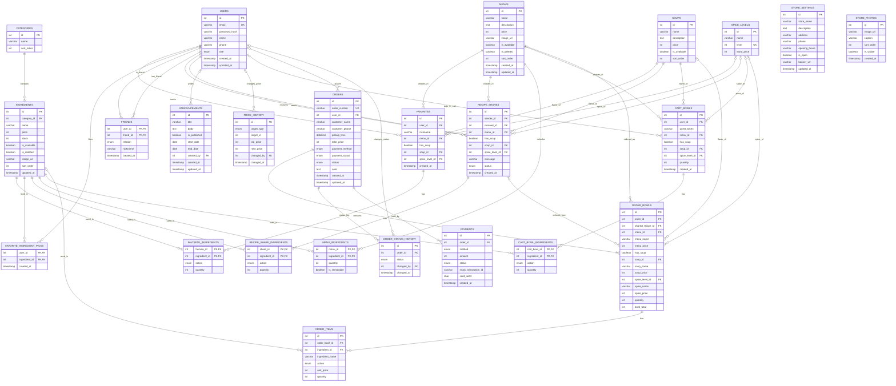

# Malatang EC - ER Diagram

24 tables · 39 relationships (malatang_ec, version 4 — Oct 20, 2026)

```mermaid
erDiagram
    %% ===== Lin: accounts, favorites, Family & Friends =====
    MENUS ||--o{ FAVORITES : chosen_in
    SOUPS ||--o{ FAVORITES : flavor_of
    SPICE_LEVELS |o--o{ FAVORITES : spice_of
    USERS ||--o{ FAVORITES : saves
    FAVORITES ||--o{ FAVORITE_INGREDIENTS : has
    INGREDIENTS ||--o{ FAVORITE_INGREDIENTS : used_in
    USERS ||--o{ FAVORITE_INGREDIENT_PICKS : likes
    INGREDIENTS ||--o{ FAVORITE_INGREDIENT_PICKS : liked_in
    USERS ||--o{ FRIENDS : is_friend
    USERS ||--o{ FRIENDS : has_friend
    MENUS ||--o{ RECIPE_SHARES : chosen_in
    USERS ||--o{ RECIPE_SHARES : receives
    USERS ||--o{ RECIPE_SHARES : sends
    SOUPS ||--o{ RECIPE_SHARES : flavor_of
    SPICE_LEVELS |o--o{ RECIPE_SHARES : spice_of
    INGREDIENTS ||--o{ RECIPE_SHARE_INGREDIENTS : used_in
    RECIPE_SHARES ||--o{ RECIPE_SHARE_INGREDIENTS : has

    %% ===== Myat: store, menu, ingredients, prices =====
    USERS |o--o{ ANNOUNCEMENTS : writes
    CATEGORIES ||--o{ INGREDIENTS : contains
    INGREDIENTS ||--o{ MENU_INGREDIENTS : used_in
    MENUS ||--o{ MENU_INGREDIENTS : includes
    USERS |o--o{ PRICE_HISTORY : changes_price

    %% ===== Zan: cart, orders, payment =====
    MENUS ||--o{ CART_BOWLS : chosen_in
    SOUPS ||--o{ CART_BOWLS : flavor_of
    SPICE_LEVELS |o--o{ CART_BOWLS : spice_of
    USERS |o--o{ CART_BOWLS : puts_in_cart
    CART_BOWLS ||--o{ CART_BOWL_INGREDIENTS : has
    INGREDIENTS ||--o{ CART_BOWL_INGREDIENTS : used_in
    USERS |o--o{ ORDERS : places
    MENUS |o--o{ ORDER_BOWLS : ordered_as
    ORDERS ||--|{ ORDER_BOWLS : contains
    RECIPE_SHARES |o--o{ ORDER_BOWLS : ordered_from
    SOUPS |o--o{ ORDER_BOWLS : flavor_of
    SPICE_LEVELS |o--o{ ORDER_BOWLS : spice_of
    INGREDIENTS |o--o{ ORDER_ITEMS : used_in
    ORDER_BOWLS ||--o{ ORDER_ITEMS : has
    USERS |o--o{ ORDER_STATUS_HISTORY : changes_status
    ORDERS ||--o{ ORDER_STATUS_HISTORY : status_log
    ORDERS ||--o{ PAYMENTS : paid_by

    USERS {
        int id PK
        varchar email UK
        varchar password_hash
        varchar name
        varchar phone
        enum role
        timestamp created_at
        timestamp updated_at
    }

    FAVORITES {
        int id PK
        int user_id FK
        varchar nickname
        int menu_id FK
        boolean has_soup
        int soup_id FK
        int spice_level_id FK
        timestamp created_at
    }

    FAVORITE_INGREDIENTS {
        int favorite_id PK, FK
        int ingredient_id PK, FK
        enum action
        int quantity
    }

    FAVORITE_INGREDIENT_PICKS {
        int user_id PK, FK
        int ingredient_id PK, FK
        timestamp created_at
    }

    FRIENDS {
        int user_id PK, FK
        int friend_id PK, FK
        enum relation
        varchar nickname
        timestamp created_at
    }

    RECIPE_SHARES {
        int id PK
        int sender_id FK
        int receiver_id FK
        int menu_id FK
        boolean has_soup
        int soup_id FK
        int spice_level_id FK
        varchar message
        enum status
        timestamp created_at
    }

    RECIPE_SHARE_INGREDIENTS {
        int share_id PK, FK
        int ingredient_id PK, FK
        enum action
        int quantity
    }

    STORE_SETTINGS {
        int id PK
        varchar store_name
        text description
        varchar address
        varchar phone
        varchar opening_hours
        boolean is_open
        varchar banner_url
        timestamp updated_at
    }

    STORE_PHOTOS {
        int id PK
        varchar image_url
        varchar caption
        int sort_order
        boolean is_visible
        timestamp created_at
    }

    ANNOUNCEMENTS {
        int id PK
        varchar title
        text body
        boolean is_published
        date start_date
        date end_date
        int created_by FK
        timestamp created_at
        timestamp updated_at
    }

    CATEGORIES {
        int id PK
        varchar name
        int sort_order
    }

    INGREDIENTS {
        int id PK
        int category_id FK
        varchar name
        int price
        int stock
        boolean is_available
        boolean is_deleted
        varchar image_url
        int sort_order
        timestamp updated_at
    }

    MENUS {
        int id PK
        varchar name
        text description
        int price
        varchar image_url
        boolean is_available
        boolean is_deleted
        int sort_order
        timestamp created_at
        timestamp updated_at
    }

    MENU_INGREDIENTS {
        int menu_id PK, FK
        int ingredient_id PK, FK
        int quantity
        boolean is_removable
    }

    SOUPS {
        int id PK
        varchar name
        text description
        int price
        boolean is_available
        int sort_order
    }

    SPICE_LEVELS {
        int id PK
        varchar name
        int level UK
        int extra_price
    }

    PRICE_HISTORY {
        int id PK
        enum target_type
        int target_id
        int old_price
        int new_price
        int changed_by FK
        timestamp changed_at
    }

    CART_BOWLS {
        int id PK
        int user_id FK
        varchar guest_token
        int menu_id FK
        boolean has_soup
        int soup_id FK
        int spice_level_id FK
        int quantity
        timestamp created_at
    }

    CART_BOWL_INGREDIENTS {
        int cart_bowl_id PK, FK
        int ingredient_id PK, FK
        enum action
        int quantity
    }

    ORDERS {
        int id PK
        varchar order_number UK
        int user_id FK
        varchar customer_name
        varchar customer_phone
        datetime pickup_time
        int total_price
        enum payment_method
        enum payment_status
        enum status
        text note
        timestamp created_at
        timestamp updated_at
    }

    ORDER_BOWLS {
        int id PK
        int order_id FK
        int shared_recipe_id FK
        int menu_id FK
        varchar menu_name
        int menu_price
        boolean has_soup
        int soup_id FK
        varchar soup_name
        int soup_price
        int spice_level_id FK
        varchar spice_name
        int spice_price
        int quantity
        int bowl_total
    }

    ORDER_ITEMS {
        int id PK
        int order_bowl_id FK
        int ingredient_id FK
        varchar ingredient_name
        enum action
        int unit_price
        int quantity
    }

    ORDER_STATUS_HISTORY {
        int id PK
        int order_id FK
        enum status
        int changed_by FK
        timestamp changed_at
    }

    PAYMENTS {
        int id PK
        int order_id FK
        enum method
        int amount
        enum status
        varchar mock_transaction_id
        char card_last4
        timestamp created_at
    }
```