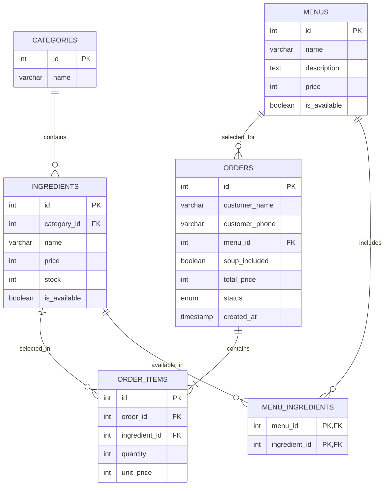

# Malatang EC - ER Diagram

```mermaid
erDiagram
    CATEGORIES ||--o{ INGREDIENTS : contains
    MENUS ||--o{ ORDERS : selected_for
    ORDERS ||--|{ ORDER_ITEMS : contains
    INGREDIENTS ||--o{ ORDER_ITEMS : selected_in
    MENUS ||--o{ MENU_INGREDIENTS : includes
    INGREDIENTS ||--o{ MENU_INGREDIENTS : available_in

    CATEGORIES {
        int id PK
        varchar name
    }

    INGREDIENTS {
        int id PK
        int category_id FK
        varchar name
        int price
        int stock
        boolean is_available
    }

    MENUS {
        int id PK
        varchar name
        text description
        int price
        boolean is_available
    }

    ORDERS {
        int id PK
        varchar customer_name
        varchar customer_phone
        int menu_id FK
        boolean soup_included
        int total_price
        enum status
        timestamp created_at
    }

    ORDER_ITEMS {
        int id PK
        int order_id FK
        int ingredient_id FK
        int quantity
        int unit_price
    }

    MENU_INGREDIENTS {
        int menu_id PK, FK
        int ingredient_id PK, FK
    }
```
